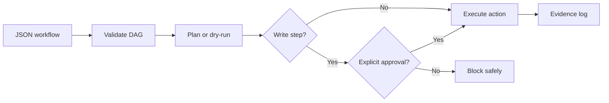

# LLM Workflow Engine

[](https://github.com/ymtzsbj/llm-workflow-engine/actions/workflows/ci.yml)
[](LICENSE)

A local-first workflow harness for reliable AI agent automation.

`llm-workflow-engine` turns small JSON workflow definitions into inspectable,
reproducible runs. It is designed for the awkward middle ground between a
useful prompt and a fully autonomous agent: workflows that need structure,
human approval, workspace boundaries, and evidence that a run really did what
it claimed.

The first release intentionally stays small:

- dependency-free Python CLI;
- DAG validation before execution;
- dry-run by default;
- explicit approval gates for file writes;
- workspace path isolation;
- SHA-256 evidence logs with opt-in metadata redaction;
- built-in actions for reading files, inspecting local Git repositories,
  rendering deterministic issue-triage drafts and templates, and writing
  files.

## Why

Agent demos often hide the parts that matter in daily maintenance: what the
agent may read, what it may change, where a failed run is recorded, and when a
human must approve a side effect.

This project makes those constraints part of the workflow definition.



## Quick Start

Python 3.9 or newer is enough.

```bash
python3 -m pip install -e .
python3 -m llm_workflow_engine.cli init my-first.workflow.json
python3 -m llm_workflow_engine.cli validate examples/daily-brief.workflow.json
python3 -m llm_workflow_engine.cli plan examples/daily-brief.workflow.json
python3 -m llm_workflow_engine.cli run examples/daily-brief.workflow.json
```

The last command is a dry-run. It creates an evidence log under
`.workflow-runs/`, but it does not write the generated brief.

The `init` command creates a schema-aware starter workflow and refuses to
overwrite an existing file unless `--force` is passed. Editors that support
JSON Schema can use [schema/workflow.schema.json](schema/workflow.schema.json)
for autocomplete and inline feedback.

Execute the approved write explicitly:

```bash
python3 -m llm_workflow_engine.cli run examples/daily-brief.workflow.json \
  --execute \
  --allow-writes \
  --approve write_brief
```

The output is written to `examples/vault/outputs/daily-brief.md`.

## Workflow Example

```json
{
  "version": "1",
  "name": "daily-brief",
  "inputs": {
    "focus": "Ship one small, verifiable improvement."
  },
  "steps": [
    {
      "id": "read_dashboard",
      "uses": "read_text",
      "with": {"path": "examples/vault/Dashboard.md"}
    },
    {
      "id": "render_brief",
      "uses": "render_template",
      "needs": ["read_dashboard"],
      "with": {
        "template": "# Daily brief\n\n## Dashboard\n${{ steps.read_dashboard.output }}\n\n## Focus\n${{ inputs.focus }}\n"
      }
    },
    {
      "id": "write_brief",
      "uses": "write_text",
      "needs": ["render_brief"],
      "approval": "required",
      "with": {
        "path": "examples/vault/outputs/daily-brief.md",
        "content": "${{ steps.render_brief.output }}"
      }
    }
  ]
}
```

See [docs/workflow-spec.md](docs/workflow-spec.md) for the complete v1 format.

## Maintainer Workflow

Generate a release note draft from the current repository without publishing
anything:

```bash
python3 -m llm_workflow_engine.cli run examples/release-notes.workflow.json
```

The `inspect_git` action runs a fixed set of read-only Git commands inside the
workspace. The release note remains a planned write until it receives explicit
approval. See [MAINTAINERS.md](MAINTAINERS.md) for this project's release and
issue-triage responsibilities.

Turn a local issue export into a reviewable triage draft:

```bash
python3 -m llm_workflow_engine.cli run examples/issue-triage.workflow.json
```

The `render_issue_triage` action parses a local JSON export and suggests a
priority, labels, and follow-up questions with deterministic rules. It does not
call the GitHub API or update issues. See
[examples/fixtures/issues.json](examples/fixtures/issues.json) for the small
fixture format and [Issue #1](https://github.com/ymtzsbj/llm-workflow-engine/issues/1)
for the public implementation task.

Point the same workflow at your own local export without changing the checked-in
example:

```bash
python3 -m llm_workflow_engine.cli run examples/issue-triage.workflow.json \
  --input issue_export=path/to/issues.json
```

## Safety Model

The CLI treats model output and workflow files as untrusted inputs:

- Reads and writes must remain inside the selected workspace.
- File writes require all three signals: `--execute`, `--allow-writes`, and
  `--approve <step-id>`.
- The built-in action registry does not expose shell execution, network
  requests, account access, or publishing actions.
- Run logs record metadata and hashes, not file contents.
- Workflows may replace configured fragments in logged paths and failure
  messages before records are printed or written.

This is a foundation, not a claim that arbitrary automation is safe. See
[SECURITY.md](SECURITY.md) before adding actions with external side effects.

Opt in when a local path or error fragment should not appear in shared
evidence:

```json
{
  "evidence": {
    "redact": ["clients/acme"]
  }
}
```

Redaction keeps hashes and byte sizes intact. It reduces accidental disclosure;
review `.workflow-runs/<run-id>/run.json` before sharing it.

## Project Status

`v0.3.0` is an early alpha focused on a trustworthy local execution core and
small maintainer workflows. The next milestones are tracked in
[ROADMAP.md](ROADMAP.md).

The initial use case came from a manually tested personal knowledge workflow:
read a local dashboard, render a daily brief, and require review before writing
the draft back to the workspace. The repository generalizes that pattern
without publishing private notes or account data.

## Contributing

Issues and small pull requests are welcome. Start with
[CONTRIBUTING.md](CONTRIBUTING.md), then use the issue templates so proposals
include a reproducible workflow and a verification plan.

## License

[MIT](LICENSE)
